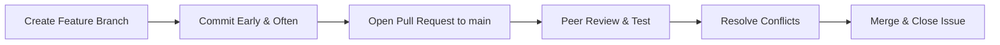

# COMP9018_2026_SM2 - Project Contribution & Workflow Rules

> 📝 **Please Read:** All team members must strictly follow the development workflows, documentation regulations, and naming conventions outlined below.

---

## 🛠 Workload Documentation & Issue Tracking

* **Issue Mapping:** Map every single project requirement to a dedicated **GitHub Issue**.
* **Task Assignment:** Always assign yourself to an Issue **before** you start working on it. Never write code for unassigned tasks.
* **Project Boards:** Track progress using a **GitHub Project Board** (Kanban style) featuring four mandatory columns:
  * `To Do`
  * `In Progress`
  * `Review`
  * `Done`
* **Commit Frequency:** Commit code **early and often**. 
  * ⚠️ *Warning:* Large, single-day code dumps at the end of the semester look suspicious to automated plagiarism tools and contribution trackers. Keep your git history incremental and organic!

---

## 🌿 Branching & Naming Conventions

> 🚨 **CRITICAL RULE:** NEVER CODE DIRECTLY ON THE `main` BRANCH!! Always implement a feature-branch workflow.

### Branch Naming Nomenclature
Use lowercase letters, hyphens to separate words, and ensure your branch includes a valid category prefix as shown in the table below:

| Category Prefix | Purpose | Examples |
| :--- | :--- | :--- |
| **`feature/`** | For developing new features | `feature/user-login`, `feature/database-setup` |
| **`fix/`** | For resolving bug fixes | `fix/auth-error`, `fix/broken-css` |
| **`refactor/`** | For code optimization without altering functionality | `refactor/api-calls` |

---

## 🔄 Pull Request (PR) & Code Review Workflow

1. **Create a PR:** When a feature or fix is completed, open a Pull Request from your branch targeting the `main` branch.
2. **Link Issues:** Include text like `Closes #IssueNumber` inside your PR description. This automatically links and closes the corresponding issue when merged.
3. **Peer Review:** At least **one other teammate** must thoroughly review the code, test it locally if necessary, and explicitly click **"Approve"**.
4. **Conflict Resolution:** The PR author bears the sole responsibility for tracking and resolving any merge conflicts prior to final merging.
5. **The 24-Hour Rule:** Give teammates at least **24 hours** to review a PR before bumping them or sending follow-up alerts on team chat.

---

## 👥 Team Members
* 👤 **Tom**
* 👤 **Mason**
* 👤 **Mingyang**
* 👤 **Seb Asleif**
