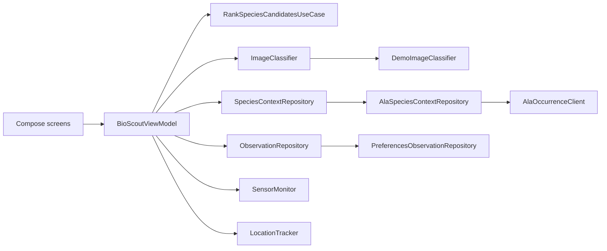

# Architecture

## Design goals

The baseline architecture is designed to:

- keep Android framework code separate from the ranking algorithm;
- show an image-only result before waiting for network context;
- support live, partial and offline data paths;
- replace the demo classifier and local store without rewriting the UI;
- make algorithms and failure handling testable;
- preserve clear code ownership for team review and the individual viva.

## Dependency direction



Dependencies point inward toward domain types and interfaces. The domain model and ranking use case contain no Android imports.

## Entry point and UI state

`MainActivity.kt` creates `BioScoutViewModel` through `AppContainer` and renders `BioScoutApp`.

`BioScoutViewModel` owns one immutable `BioScoutUiState`, including:

- current screen;
- sensor snapshot and location status;
- selected habitat and captured photo path;
- image predictions and image-only ranking;
- nearby context and fused ranking;
- loading, warning and fallback states;
- selected candidate and saved observations.

Compose screens render this state and emit events. They do not perform HTTP requests or ranking calculations.

## Package map

### `domain/model`

Framework-independent types for species, habitat, image predictions, locations, sensors, nearby context, evidence, ranked candidates, observations and screens.

### `domain/repository`

Three replacement seams:

- `ImageClassifier` — returns a Top-K candidate list;
- `SpeciesContextRepository` — returns nearby occurrence counts and source telemetry;
- `ObservationRepository` — loads and saves confirmed observations.

### `domain/usecase/RankSpeciesCandidatesUseCase`

Contains image-only normalisation and the context-fusion algorithm. It is a pure Kotlin class and is covered by JVM tests.

### `data/classifier`

`DemoImageClassifier` returns deterministic scores with a small photo-path-derived variation. This demonstrates asynchronous state and reranking but does not inspect pixels.

A future `TfliteImageClassifier` should implement the same interface, perform bitmap preprocessing, run an on-device model and return 10–20 mapped candidates.

### `data/ala`

`AlaOccurrenceClient` performs count-only, read-only occurrence searches. It builds the query, enforces timeouts, parses `totalRecords` strictly and records request telemetry.

`AlaSpeciesContextRepository` requests all candidate counts concurrently. It preserves coroutine cancellation, merges partial responses with deterministic fallback counts and reports whether the source was live, partial or offline.

### `data/observation`

`PreferencesObservationRepository` stores up to 100 observations as JSON in application preferences and keeps photos in app-internal storage. It is a prototype implementation, not the final cloud architecture.

### `platform`

`SensorMonitor` wraps accelerometer, gyroscope, light and magnetic-field sensors. `LocationTracker` wraps the platform GPS/network location providers without requiring Google Play Services.

### `ui`

`BioScoutApp` provides navigation and screen selection. Screen composables contain display logic and user interactions. Shared components provide status chips, evidence bars, habitat selection and photo thumbnails.

## Runtime flow

```text
User captures a photo
  -> ViewModel starts analysis
  -> ImageClassifier returns Top-K candidates
  -> image-only ranking is exposed immediately
  -> SpeciesContextRepository requests nearby counts concurrently
  -> result is labelled live, partial or fallback
  -> RankSpeciesCandidatesUseCase applies location, season and habitat
  -> fused Top 3 and evidence are displayed
  -> user changes habitat, causing a local rerank without another request
  -> user confirms a candidate
  -> location is coarsened and observation is persisted
```

The guided demo skips live network use and fixes the date, location and context data so the explanation is repeatable.

## Sensor processing

### Stability

The accelerometer magnitude is compared with gravity to estimate translational disturbance. Gyroscope magnitude estimates angular motion. The two signals are combined into a target stability value and exponentially smoothed:

```text
stabilityTarget = exp(-(1.55 * accelerationDeviation + 1.25 * angularVelocity))
smoothed = 0.82 * previous + 0.18 * target
```

Capture is considered stable when the score reaches the current heuristic threshold of `0.78`. These constants require physical-device calibration before final submission.

### Heading

Low-pass-filtered gravity and magnetic vectors are used with Android's rotation matrix to calculate azimuth. Heading is optional because some devices lack a magnetometer or the reading may be disturbed indoors.

### Light

Ambient lux is mapped to simple low-light, usable and possible-glare messages. The thresholds are prototype heuristics and should be tested across devices and outdoor conditions.

## Context fusion

For each candidate species `s`:

```text
raw(s) = α log(Pimage(s) + ε)
       + β log(Plocation(s) + ε)
       + γ log(Pseason(s) + ε)
       + δ log(Phabitat(s) + ε)
```

Current weights:

| Cue | Weight |
|---|---:|
| Image | 1.00 |
| Location | 0.75 |
| Season | 0.35 |
| Habitat | 0.45 |

Nearby counts use additive smoothing:

```text
Plocation(s) = (count(s) + λ) / (sum(counts) + λN)
λ = 3
```

A numerically stable softmax converts raw values into relative ranking scores. The values are only comparable within the current candidate set and are not calibrated probabilities.

## Responsiveness

The ViewModel exposes the image-only list as soon as classification returns. ALA queries continue asynchronously on an I/O dispatcher, and the UI reranks when context arrives. Changing the habitat reuses existing context and reruns only the local fusion algorithm.

This design supports a responsive interface, but final claims require measured inference, network and end-to-end latency rather than architectural reasoning alone.

## Failure handling

| Dependency | Normal path | Fallback or control |
|---|---|---|
| Camera | CameraX preview and capture | Guided demo remains available. |
| Accelerometer/gyroscope | Stability gate | Manual capture if required sensors are unavailable. |
| Ambient light | Lux feedback | Explicit unavailable state. |
| Magnetometer | Heading metadata | Explicit unavailable state. |
| Location | GPS/network location | Campus demo location with visible label. |
| ALA | Live candidate counts | Partial merge, persistent warning, retry or deterministic fallback. |
| Image model | Future TFLite model | Clearly labelled deterministic demo adapter. |
| Cloud store | Future Firebase implementation | Local observation repository. |

Fallbacks must remain visible. The app should never silently present demo data as live data.

## Privacy and persistence

Before saving an observation, latitude and longitude are rounded to three decimal places and accuracy metadata is removed. This is a basic privacy measure, not a complete sensitive-species policy. Future cloud work should add user consent, deletion, access control, data retention and stronger location obfuscation where appropriate.

## Tests

Current JVM tests cover:

- image/location/season/habitat reranking;
- softmax normalisation;
- smoothing when nearby counts are missing;
- recorded ALA response parsing and malformed schemas;
- count-only query construction and HTTP failures;
- guided fallback, complete live data, partial data and cancellation.

Run:

```bash
./gradlew testDebugUnitTest
```

Final evaluation also requires physical-device and end-to-end tests that cannot be replaced by JVM tests.

## Planned replacement points

### TensorFlow Lite

Implement `TfliteImageClassifier`, add image preprocessing and map every model label to a stable internal species and ALA taxon identifier. Preserve a Top-K list and add unknown/genus-level handling.

### Firebase or equivalent cloud backend

Implement `ObservationRepository` with separate photo and metadata operations, authentication, security rules, an offline queue and observable upload state.

### Cache

Add a Room-backed context cache with a documented geographic key, search radius and freshness policy. Cache results should reduce latency without hiding stale data.

### Showcase extension

Choose one: a privacy-preserving campus biodiversity map or a team observation mission. It should consume the same observation repository rather than introduce a separate data model.
