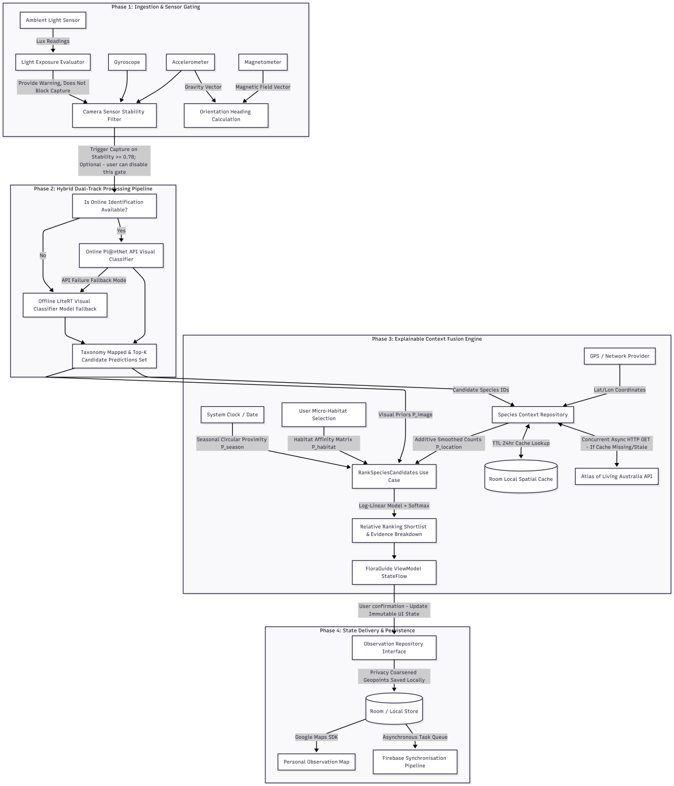
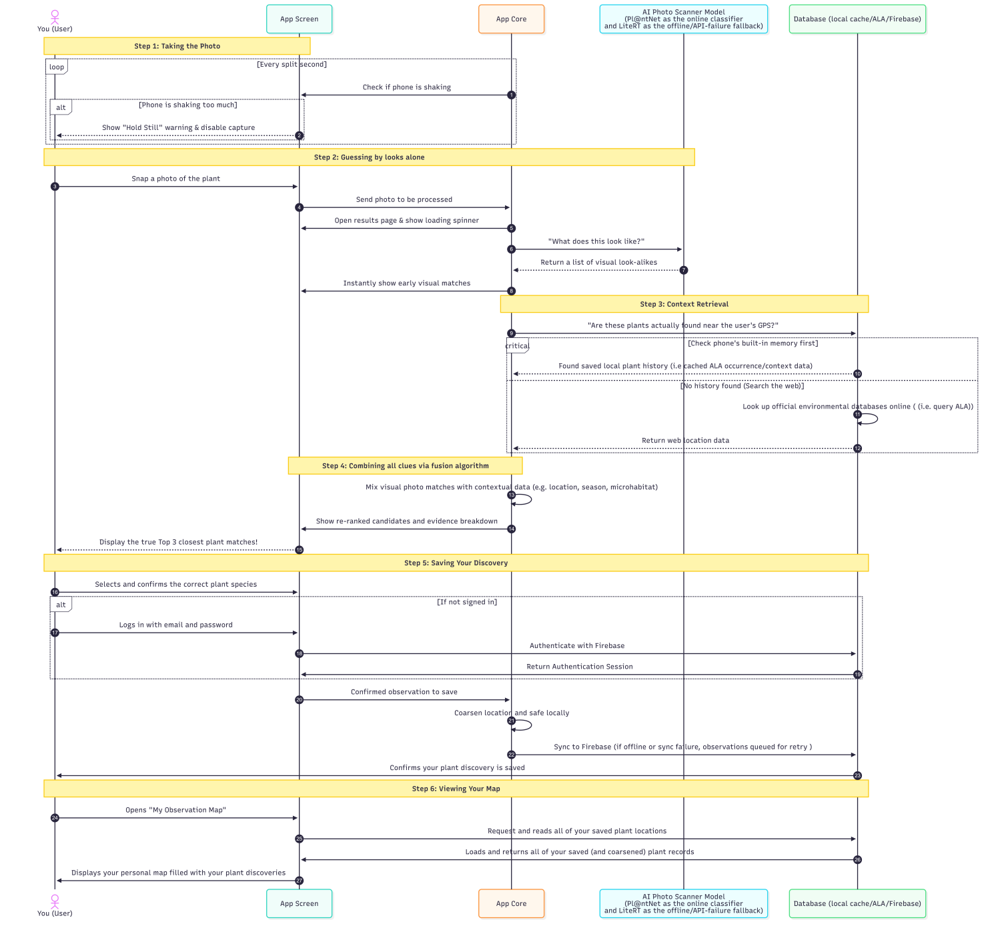
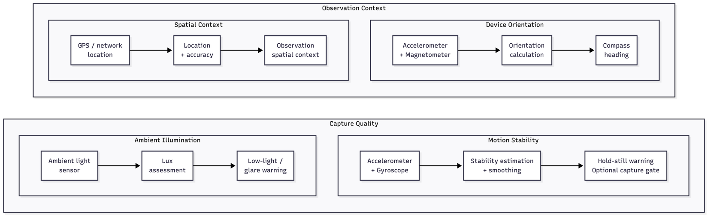
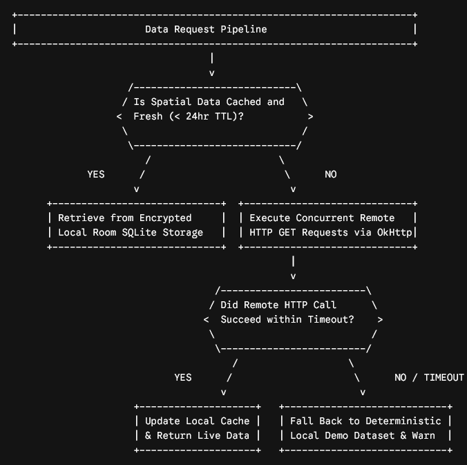
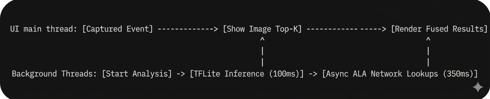
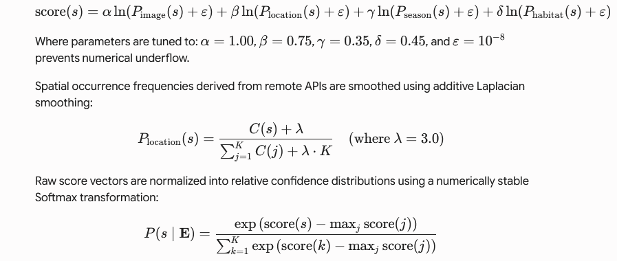
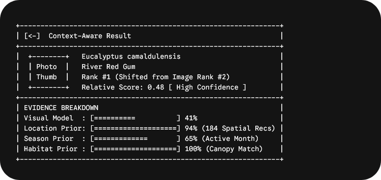
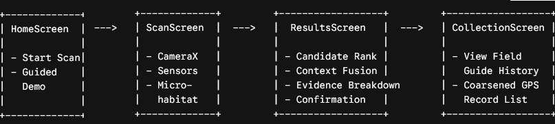
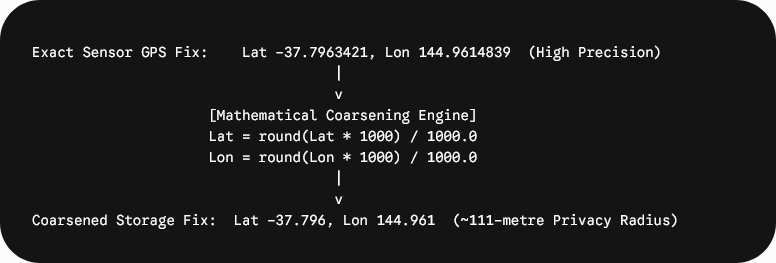

<!-- Source: COMP90018_2026_T01_03_03 Assignment 1.pdf. Original language and wording retained. -->

# FloraGuide Android Mobile App Project Plan

*Explainable, Context-Aware Mobile Species Identification for Campus Plant Life and Botany*

**Course:** COMP90018 Mobile Computing Systems Programming

**Group Number:** T01/03-03

**Team Members:** (fill in your own individual name, student id, email and Github username)

1. Tom Chen | Student ID: 1668708 | hantang.chen@student.unimelb.edu.au | tomchen86
2. Mason Lu | Student ID: 1170302 | malu@student.unimelb.edu.au | Malu1170302
3. Mingyang Sun | Student ID: 1657392 | mingyangsun@student.unimelb.edu.au | mingyang-sun1
4. Eu Choon SIA (Seb) | Student ID: 1279050 | euchoons@student.unimelb.edu.au | euchoons
5. Asleif | Student ID: 1173455 | weiaa@student.unimelb.edu.au | weiaa

**Group Github Repo:** <https://github.com/euchoons/COMP90018_2026_SM2/>

## Executive Summary & System Overview

FloraGuide is a mobile computer vision and environmental data-fusion ecosystem prototype engineered to resolve fine-grained taxonomic identification ambiguities in urban micro-habitats. It addresses a fundamental limitation in current mobile ecological survey tools: reliance on isolated visual predictions. Visual-only inference frequently exhibits high uncertainty or complete misclassification when encountering morphological convergence, varied lighting, or partial occlusion. Our mobile app aims to resolve these failure modes by deploying a mobile context-aware pipeline that captures, fuses, and explains heterogeneous environmental signals alongside computer vision.

Our prototype mobile app will execute an end-to-end processing loop driven by hardware sensors and ecological data. To guarantee a crisp image, background monitors fuse accelerometer and gyroscope streams to measure hand tremors, locking the camera shutter until the device is perfectly still. Concurrently, the light sensor evaluates ambient lux to warn of poor exposure conditions, while the magnetic sensor acts as a compass to log the user’s orientation heading. Once a user captures a photo, a localized TensorFlow Lite (TFLite) vision model will extract a Top-K candidate set. The app then sharpens its identification accuracy by evaluating three environmental constraints: the timestamp verifies seasonal compatibility, the user-selected microhabitat captures the immediate ecological surroundings, and the GPS coordinates trigger concurrent, asynchronous queries to the Atlas of Living Australia (ALA) API to pull nearby species history. By fusing the camera's visual predictions with these real-world location, seasonal, and habitat clues, the system overrides black-box classification errors and ranks the most contextually compatible plant at the top of the shortlist.

These heterogeneous evidence streams will feed into an explainable log-linear fusion engine, which will re-rank candidate taxa and present a cue-level explanation showing how image, nearby-occurrence, seasonal and microhabitat evidence affected the final ranking. Confirmed records will persist locally and synchronize asynchronously with a cloud backend, preserving spatial privacy through dynamic precision coarsening.

Although the underlying architecture supports nationwide lookups via the ALA API, our immediate MVP testing is strategically restricted to the University of Melbourne campus scope to ensure immediate feasibility.

## Mobile App MVP System Architecture & Data Fusion Pipeline

The internal data ingestion, processing, signal fusion, and UI state mapping framework is modeled as follows:

## User WorkFlow End-to-End Observation Lifecycle Sequence

This behavioral schematic tracks the structural processing workflow of a single observation task.

## Detailed Plan Against Assignment 2 Rubric

### Material Criteria

#### 1. Material — Report and Video

- **How:** The team will produce a comprehensive final engineering report alongside a high-definition 10-minute video presentation. The video will be recorded on physical Android devices. It will systematically demonstrate the complete operational flow: camera capture, live stability gating, real-time ALA queries, rank reversals driven by context fusion, offline queueing, and Firebase backend synchronization.

- **Why:** This detailed presentation will prove that all software components exist within a fully integrated mobile ecosystem rather than an isolated desktop simulation.

- **Feasibility:** Highly feasible. Main dependency is having a sufficiently integrated and stable MVP to demonstrate.

#### 2. Material — Screenshot

- **How:** The final submission package will contain clean terminal output capture logs showing an executed Gradle build executed on a clean clone of the tagged repository commit.

- **Why:** Verifying execution against a fresh checkout guarantees reproducible builds, confirming that no local environment variables, uncommitted assets, or cached IDE states are required.

- **Feasibility:** Providing build/run evidence is straightforward once a reproducible Gradle build and working APK have been established.

#### 3. Material — Commit Log

- **How:** All development activities will occur within a shared Git repository enforcing branch protection policies, feature-branch workflows, compulsory peer reviews, and standard commit message formats.

- **Why:** A structured commit graph provides undeniable evidence of organic, equitable collaboration across all team members over time.

- **Feasibility:** Readily achievable through disciplined Git branching, meaningful commits and peer-reviewed pull requests throughout development

#### 4. Material — Itemised Contributions

- **How:** The team will submit a single-page contribution breakdown detailing specific software artifacts, subsystem ownership, unit test suites, and documentation files created by each member.

- **Why:** Itemizing exact deliverables prevents ambiguous accountability and ensures that every individual can independently defend their contributions for viva verification.

- **Feasibility:** Depends primarily on establishing realistic ownership and ensuring workloads remain balanced.

### Implementation Criteria

#### 5. Implementation — Quality

- **How:** The software will follow clean architecture principles using Kotlin coroutines, dependency injection, and unidirectional data flow. The codebase will enforce strict separation between UI, domain, and data layers.

- **Why:** Decoupling framework components from business logic ensures high maintainability, prevents memory leaks, and allows isolated unit testing of core algorithms.

- **Feasibility:** Highly achievable with standard Android development practices

#### 6. Implementation — Sensors

- **How:** The application will process data from five distinct hardware sensors: accelerometer, gyroscope, ambient light sensor, magnetometer, and satellite GPS/network location providers. Continuous sensor streams will be fused using basic low pass filter to establish motion stability, ambient illumination suitability, and orientation vectors.

  

- **Why:** Raw sensor inputs are noisy and volatile. Algorithmic smoothing transforms low-level electrical sensor signals into high-level environmental capture readiness states. Fusing hardware sensor streams provides dynamic capture quality control, preventing motion-blurred captures from entering the visual classifier while enriching records with spatial context.

- **Feasibility:** Achievable but requires testing, filtering, calibration, and graceful handling of unavailable sensors

#### 7. Implementation — Connectivity

- **How:** FloraGuide will utilize an asynchronous OkHttp3 network client to execute concurrent REST requests against the Atlas of Living Australia API. Cloud synchronization will run via Firebase Firestore and Firebase Storage. To support offline operation, the app will feature a local Room cache and a resilient offline transactional queue.

  

- **Why:** External biodiversity records provide critical location priors, while cloud persistence enables cross-device synchronization. A local caching layer backed by persistent storage guarantees that network failures do not halt field operations

- **Feasibility:** Achievable but may represent implementation workload

#### 8. Implementation — Responsiveness

- **How:** The system will implement progressive state rendering to deliver immediate user feedback. Upon photo capture, the vision inference model will process the frame on a dedicated background thread (Dispatchers.Default) and display initial visual candidate rankings ideally within 100 ms. Concurrent spatial API lookups will execute on an I/O dispatcher (Dispatchers.IO). When remote environmental data arrives, the UI state will smoothly transition to display the re-ranked candidates without freezing the main thread.

  

- **Why:** Asynchronous thread isolation prevents main thread blockages, maintaining ideally 60 FPS UI rendering during compute-heavy neural inference and network I/O

- **Feasibility:** Actual performance will need to be measured on physical devices because model inference, image processing and network latency are difficult to guarantee in advance.

#### 9. Implementation — Technical Depth

- **How:** The technical core will feature an explainable log-linear Bayesian data fusion engine that combines visual likelihoods with spatial, temporal, and microhabitat priors, followed by numerically stable Softmax normalization. For any given candidate species (s) within the visual prediction set, the unnormalized log-likelihood score(s) is expressed as:

  $$
  \operatorname{score}(s)
  = \alpha \ln\!\left(P_{\mathrm{image}}(s) + \varepsilon\right)
  + \beta \ln\!\left(P_{\mathrm{location}}(s) + \varepsilon\right)
  + \gamma \ln\!\left(P_{\mathrm{season}}(s) + \varepsilon\right)
  + \delta \ln\!\left(P_{\mathrm{habitat}}(s) + \varepsilon\right)
  $$

  Where parameters are tuned to: $\alpha = 1.00$, $\beta = 0.75$, $\gamma = 0.35$, $\delta = 0.45$, and $\varepsilon = 10^{-8}$ prevents numerical underflow.

  Spatial occurrence frequencies derived from remote APIs are smoothed using additive Laplacian smoothing:

  $$
  P_{\mathrm{location}}(s)
  = \frac{C(s) + \lambda}{\displaystyle\sum_{j=1}^{K} C(j) + \lambda \cdot K}
  \qquad (\text{where } \lambda = 3.0)
  $$

  Raw score vectors are normalized into relative confidence distributions using a numerically stable Softmax transformation:

  $$
  P(s \mid \mathbf{E})
  = \frac{\exp\!\left(\operatorname{score}(s) - \max_j \operatorname{score}(j)\right)}
  {\displaystyle\sum_{k=1}^{K}\exp\!\left(\operatorname{score}(k) - \max_j \operatorname{score}(j)\right)}
  $$

  

  
Original formula figure (page 6)

  

  

  Crucially, the initial hyperparameter weights established in the baseline application serve strictly as a heuristic starting point. As part of the project execution plan, these weights will be continuously tuned and finalized to optimize Top-1 and Top-3 accuracy profiles against real-world device noise and sparse regional data.

- **Why:** Deep visual classifiers often misclassify morphologically similar species when processing single images. Combining multi-modal evidence streams mathematically resolves visual ambiguity, producing superior candidate ranking compared to single-mode image classifiers.

- **Feasibility:** The major challenge is validating and tuning these algorithms rather than merely implementing them

### User Interface Criteria

#### 10. User Interface — Appeal

- **How:** Study existing design that offers a similar service/application. Using these reference designs, we will construct our UI using plant themed motifs that will be implemented sparingly across the user interface to achieve minimal and modern design (green color, botanical iconography etc.), keeping the practicality as focus. The interface will be built using Jetpack Compose, implementing Material Design 3 guidelines which also allows us to use component libraries that are built by professional UI designers/developers for our application.

- **Why:** A well balance of practicality and aesthetic focused design increases engagement and reduces bounce rate. Aesthetics keeps the application interesting initially, and a good practical UI allow the user to easily identify area of interest to navigate around, thus understands the application faster.

  - For example, after snapping a photo, an example of the layout of the results is displayed below. This layout features top-down priority, where the most important info is at the top (summarized), and the breakdown is below, if the user wants to know why (it is visualized in a bar chart to help the user to quickly compare relatively). Most of the time the user will engage with the top half of the page (prioritizing relative score, the primary goal) before bouncing off to another page.

    

- **Feasibility:** Achievable as this specific application already exist in many different variations, hence there a large library of references material that we can refer to when implementing the UI design.

#### 11. User Interface — Guidelines

- **How:** The app will adhere to Android platform UX guidelines and WCAG 2.1 AA accessibility guidelines, handling runtime permissions, system back gestures, adaptive layouts, edge-to-edge rendering, and explicit Content Descriptions for screen reader compatibility (TalkBack) accessibility attributes.

- **Why:** Adhering to platform standards ensures predictable behavior, high usability, and full accessibility for users with disabilities.

- **Feasibility:** Achievable using established Android platform facilities

#### 12. User Interface — Flow

- **How:** The application will follow an intuitive primary workflow: Home → Scan/Observe → Results Analysis → Collection/Field Guide. Users will maintain continuous control, with options to retake captures, adjust microhabitat selections, or retry failed queries.

  

- **Why:** A logical, frictionless navigation flow reduces cognitive load during field operations, ensuring efficient observational data collection.

- **Feasibility:** Workflow is straightforward to implement using Compose navigation and explicit application states. Complexity mainly arises from handling asynchronous classification, network failures and retry paths.

#### 13. User Interface — Language

- **How:** All user-facing strings will use clear, precise, non-technical terminology and will explicitly differentiate between raw model outputs, relative candidate ranking scores, external occurrence record counts, and data source modes (e.g., Live ALA API vs. Offline Cache) The interface will also explicitly describe scores as "relative candidate likelihoods" rather than absolute confidence percentages. It will refrain from displaying deceptive claims such as "100% Species Accuracy."

- **Why:** Clear and transparent language prevents over-reliance on automated predictions. This prevents user misinterpretation, setting accurate expectations for statistical AI outputs. It also encourages users to critically evaluate environmental evidence.

- **Feasibility:** The main requirement is carefully distinguishing relative model rankings, occurrence data and data-source status without overstating certainty.

#### 14. User Interface — Reactiveness

- **How:**

  - The UI will dynamically respond to continuous sensor inputs, updating stability badges, ambient light alerts, and orientation metrics in real time. Microhabitat selection changes will trigger instant local re-ranking without triggering network requests.

  - Animation (button press, navigating from page to page etc.) and physical response (i.e., device vibration when error happened)

- **Why:** Real-time visual feedback confirms that the system is processing environmental context actively, increasing trust in the application. Instant feedback demonstrates system responsiveness and reveals how individual environmental factors influence the ranking algorithm.

- **Feasibility:** High-frequency sensor updates must be throttled to avoid unnecessary recomposition, battery consumption and performance problems.

### Innovation Criteria

#### 15. Innovation — Novelty

- **How:** FloraGuide introduces a novel mobile paradigm by integrating explicitly selectable microhabitats, real-time spatial occurrence priors, seasonal clock priors and physical sensor gating directly into a field observation tool. It shifts mobile visual identification from isolated computer vision calls to an explainable context-aware multi-modal fusion architecture.

- **Why:** Existing mobile solutions rely almost exclusively on black-box visual classifiers, failing to leverage local ecological context available to the device.

- **Feasibility:** Claims will be supported through comparison with existing visual identification applications

#### 16. Innovation — Surprise

- **How:** The application will deliver a compelling user experience by demonstrating rank reversals, where a secondary visual candidate ascends to the Top-1 position based on strong spatial, temporal, and microhabitat compatibility. The system exposes context-driven ranking adjustments by displaying side-by-side candidate ordering comparisons: Visual-Only Rank versus Context-Fused Rank. This transparent framework demonstrates how environmental factors can elevate a lower-ranked visual candidate to the top position when local occurrence data and seasonal priors strongly support it.

- **Why:** Visual rank reversals clearly show the power of context-aware computing, revealing how environmental evidence can overcome visual ambiguity. It transforms the AI output into an educational, explainable tool, revealing the underlying data logic to the user.

- **Feasibility:** Demonstrating context-driven ranking reversals is feasible if the fusion algorithm produces genuine changes in candidate rankings.

#### 17. Innovation — Tech Knowledge

- **How:** The project combines on-device machine learning, multi-sensor hardware signal processing, concurrent REST client architecture, spatial caching, and cloud synchronization. Furthermore, the platform also integrates techniques from multiple computer science disciplines:

  - **Computer Vision & Embedded ML:** Neural network execution on edge hardware.

  - **Signal Processing:** Real-time sensor filtering and inertial stability computation.

  - **Distributed Systems:** Asynchronous API query orchestration, HTTP caching, and resilient fallback handling.

  - **Information Theory:** Log-linear Bayesian signal fusion and Softmax normalization.

  - **Database Systems:** Local SQLite ORM persistence, spatial index structures, and background sync queues.

- **Why:** Integrating these advanced mobile computing concepts demonstrates deep mastery across software architecture, networking, embedded sensing, and AI. Furthermore, the integration of multi-disciplinary components creates a robust enterprise architecture capable of operating in complex real-world conditions.

- **Feasibility:** The breadth is achievable but workload and integration risk within the project timeframe needs to be accounted for

#### 18. Innovation — Cross-Disciplinary

- **How:** The project bridges Mobile Computing and core Quantitative Ecology principles by incorporating spatial occurrence distributions (Atlas of Living Australia (ALA) API), seasonal phenology curves, and botanical microhabitat affinities into a software pipeline to improve visual identification performance. Spatial queries consult established biodiversity data platforms (ALA) to evaluate local species presence probability.

- **Why:** Applying ecological principles directly to mobile software design produces a domain-aware application that operates in harmony with natural environmental patterns. This improves computational accuracy, anchoring visual AI outputs in real-world environmental context.

- **Feasibility:** Combining mobile computing with ecological concepts such as species occurrence, seasonality, habitat and taxonomy is feasible and provides a strong interdisciplinary dimension. However, ecological assumptions and weighting decisions must be appropriately justified rather than treated as arbitrary engineering parameters.

#### 19. Innovation — Impact

- **How:** FloraGuide will provide educational institutions and citizen scientists with a tool that improves field identification accuracy, encourages biodiversity exploration, and protects sensitive species through spatial coarsening. To protect user privacy and local ecosystems, recorded geographic coordinates are automatically coarsened to a 3-decimal-place grid (~111m precision) prior to persistence, ensuring sensitive species locations are obfuscated (see example below)

  

- **Why:** Enhancing citizen science data quality directly benefits ecological conservation efforts and community environmental awareness with data privacy safeguards personal location privacy while protecting vulnerable biological taxa from disturbance

- **Feasibility:** Claims of broad conservation or societal impact would require evidence beyond what a six-week university project can realistically establish. However, a campus-scale impact evaluation through improved identification, ecological understanding and user experience is feasible within the project scope

## AI Tools and Technologies Acknowledgement:

Google Gemini was utilized during the planning phase of this report to assist our group with architectural diagrams generation, brainstorming workload breakdowns, and editing technical descriptions. The final architecture, logic models, and report writing verification underwent mandatory human review to ensure total alignment with academic integrity guidelines and remain the sole responsibility of the development team.

## Team Member Contribution Breakdown

**Shared Contribution:** All members will contribute implementation commits, tests/evidence and one cross-review, then jointly write the final report, prepare the video

| Member | Primary implementation and concrete deliverables |
| --- | --- |
| **Tom** Fusion algorithm, explainability and evaluation | • **Pipeline and fusion** - Integrate both identification sources with the existing image-only and context-reranked flow.  • **On-device model** - Integrate PlantNet-300K ResNet18 using LiteRT, including image preprocessing, label mapping and inference.  • **Algorithm Calibration** - Tune fusion weights and smoothing and validate model handling on a labelled evaluation set.  • **Explainability** - Show cue-level evidence and keep scores labelled as relative rankings, not confidence.  • **Evaluation** - Compare Pl@ntNet and LiteRT output, image-only versus fused Top-1/Top-3, cue ablations and P50/P95 latency. |
| **Mason** Camera, sensors, location and device calibration QA | • **Camera** - Validate the existing CameraX lifecycle, capture, rotation, resize and permission paths.  • **Motion stability** - Calibrate accelerometer/gyroscope stability thresholds and justify the chosen values.  • **Hardware adapters** - Verify ambient-light guidance and magnetometer heading, including missing-sensor fallbacks.  • **Location** - Validate GPS accuracy and support the location data consumed by the campus map.  • **Device testing evidence** - Test at least two phones for denied permissions, missing sensors and camera/location failures. |
| **Mingyang** Pl@ntNet API integration | • **API ownership** - Solely own the Pl@ntNet adapter that replaces the current demo classifier.  • **API verification** - Add response fixtures, parsing/retry tests, a live-photo demo and API latency/quota evidence.  • **ALA reliability** - Validate the existing concurrent lookup for live, partial, zero-result, timeout and offline cases.  • **Data contract** - Parse Top-K scientific/common names, ranking scores, model details and quota information.  • **Credential safety** - Keep the API key outside Git and document the local developer setup.  • **Failures** - Handle no network, timeout, 401/403, 429, 5xx and invalid/non-plant inputs with tests and retry. |
| **Seb** Persistence and privacy | • **Taxonomy** - Map candidate names and synonyms to accepted ALA identifiers.  • **Cloud data** - Implement Firestore observation records and Cloud Storage photos behind the repository interface.  • **Offline fallback architecture.** Program an asynchronous local-first background syncing queue using a persistent cache to support offline observation caching.  • **Privacy** - Add per-user Security Rules, coarse coordinates, deletion and a documented retention policy. |
| **Asleif** Map UI, accessibility and usability | • **Authentication** - Implement Firebase user account registration, sign-in, session and sign-out, persistence session logging including failure states.  • **Map** - Show the user's coarse-location observations and display geographically aggregated campus plant observation marker details via integration of Google Maps SDK API; clustering remains optional.  • **UI integration** - Extend the existing Compose Results and Field Guide for identification, ALA and upload states.  • **Accessibility** - Coordinate TalkBack, large text, contrast, touch targets and clear user-facing strings.  • **Usability evidence** - Test the full Observe to Results to Confirm to Field Guide to Map flow and fix major issues; Build explicitly clear loading layouts, error warnings, actionable retry screens. |
