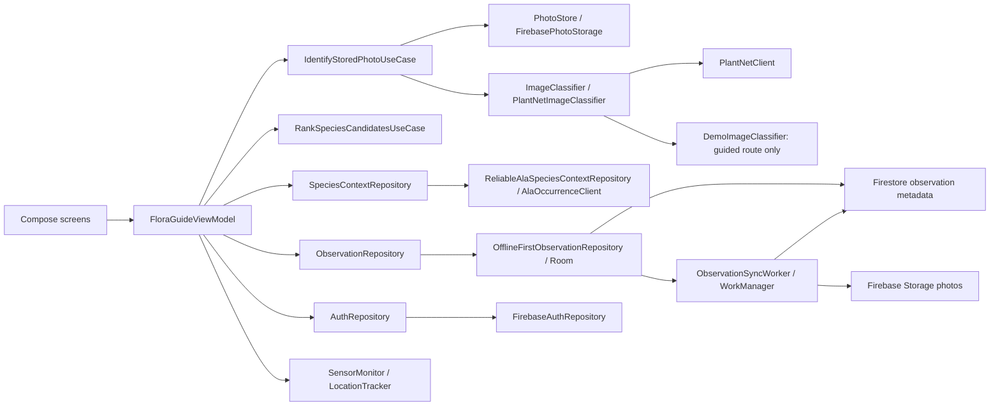

# Architecture

This document describes the implementation wired by `AppContainer`. See the [roadmap](../PROJECT_STATUS_AND_ROADMAP.md) for current status and pending work, the [live context policy](MISSING_CONTEXT_POLICY.md) for ranking semantics, and [data handling](../PRIVACY_POLICY.md) for storage/deletion limitations.

## Design goals

- Keep Android framework code separate from the ranking algorithm.
- Display an image-only result as soon as cloud classification completes, then add remote context.
- Make network failures, partial evidence and the explicit guided demo visible.
- Keep classifiers, photo transfer and persistence behind domain interfaces.
- Support focused tests and clear ownership for team review and the viva.

## Dependency direction



Dependencies point toward domain types and interfaces. The ranking use case and domain models do not import Android APIs.

## Entry point and UI state

`MainActivity` constructs `FloraGuideViewModel` through `AppContainer` and renders `FloraGuideApp`. The ViewModel owns immutable UI state for the screen, capture-time context, image predictions, rankings, stage failures, selected candidate and saved observations. Authentication is observed separately; observation subscriptions are replaced when the active account changes.

Compose screens render state and send events. They do not perform HTTP requests or ranking calculations. Home, Observe, Field Guide and Account are navigation destinations; Results is the capture-analysis flow. Field Guide embeds the observation map.

## Package map

| Package / component | Responsibility |
|---|---|
| `domain/model` | Species, capture snapshots, locations, sensors, context, ranking evidence, observations and screen state. |
| `domain/repository` | `ImageClassifier`, `SpeciesContextRepository`, `ObservationRepository`, `PhotoStore` and `AuthRepository` contracts. |
| `domain/usecase` | Stored-photo identification stages, capture-location eligibility, ranking and observation creation. |
| `data/classifier` | Deterministic guided-demo candidates; does not inspect pixels or perform live recognition. |
| `data/plantnet` | Streamed cloud identification, strict candidate parsing, request telemetry and optional predicted-organ metadata. |
| `data/ala` | Name matching at species level or below, occurrence counts, cancellation, bounded retries and source states. |
| `data/catalog` | Synthetic demo data and the sourced VicFlora flowering table. |
| `data/local` | Room database, observation entities and local synchronisation state. |
| `data/observation` | `OfflineFirstObservationRepository`, legacy Preferences import, record codecs and `ObservationSyncWorker`. |
| `data/firebase` | Firebase account adapter, photo transfer/loading and session diagnostics. |
| `platform` | Sensor and GPS/network-location adapters. |
| `ui` | Compose screens, state coordination, map, status chips, explanation and thumbnails. |

`AppContainer` wires `OfflineFirstObservationRepository` to Room. `PreferencesObservationRepository` is retained for importing older records; it is not the active observation store. Account-scoped records are saved locally and synchronised with Firestore through WorkManager, while photos use Firebase Storage. Offline/local records have an explicit import action.

## Runtime flow

```text
User captures a photo with sensor guidance
  -> capture time, heading and eligible location are frozen
  -> IdentifyStoredPhotoUseCase uploads the photo to Firebase Storage
  -> the stored photo is downloaded and passed to Pl@ntNet
  -> the ViewModel keeps the first five candidates and displays image-only ranking
  -> eligible capture locations trigger concurrent ALA lookups
  -> live context ranking and cue-level evidence are displayed
  -> the user confirms a candidate
  -> the observation is saved to Room with coarse coordinates
  -> signed-in records are queued for cloud synchronisation
```

Upload, download and classification failures retain their stage and retry controls. Classification never silently falls back to the camera original or demo data after a failed cloud transfer. Upload starts after capture; PR #48 proposes a per-photo consent step before it.

The guided demo calls the classifier without a photo path and supplies a fixed date, campus location and synthetic context. It skips the live identification/context pipeline. A missing Pl@ntNet key causes an explicit live error; it does not turn a real capture into a demo result.

## Sensor processing

### Stability

The accelerometer's deviation from gravity and gyroscope angular speed feed a smoothed stability gate. The current constants, physical interpretation, rationale and remaining device measurements live in [motion stability calibration](MOTION_STABILITY_CALIBRATION.md).

### Heading

Low-pass-filtered gravity and magnetic vectors feed the rear-camera-axis heading calculation; a flat phone uses the top-edge reference. Heading is optional, converted to true north when a device location is known (labelled magnetic otherwise), and recorded at capture time. Unavailable or unreliable measurements are surfaced instead of being presented as a good bearing. See [hardware adapter verification](../testing/HARDWARE_ADAPTERS_VERIFICATION.md).

### Light

Ambient lux drives unavailable, low, usable or very-bright guidance. It describes the sensor's surroundings rather than measuring scene exposure; the thresholds still require device calibration. Light guidance does not block capture.

## Context fusion

The [missing-context policy](MISSING_CONTEXT_POLICY.md) owns the live algorithm, trained parameters, candidate limits, missing-evidence handling and flowering data. [Fusion data sources](FUSION_DATA_SOURCES.md) records the evidence behind the source choices, and [fusion training](FUSION_EVALUATION.md) how the parameters were trained and tested. The [technical reference](TECHNICAL_REFERENCE.md#fusion-formula) retains the synthetic demo formula.

A name ALA cannot match to a species counts as zero records; a failed lookup leaves geographic support neutral for all candidates. A flower photo is checked against VicFlora flowering months, which the results card shows without reordering, because the trained season factor is 1.0. Habitat is observation metadata; changing it only affects synthetic demo ranking. Scores are relative within the candidate set, not calibrated probabilities.

## Responsiveness

Classification and transfer run asynchronously. The image-only list appears after classification returns; ALA lookups continue while the UI displays those candidates. Habitat changes rerank the synthetic demo locally and do not repeat network requests. Measured network and end-to-end latency are required for performance claims.

## Failure handling

| Dependency | Normal path | Fallback or control |
|---|---|---|
| Camera | CameraX capture | Explicit camera error; the guided demo remains available. |
| Accelerometer/gyroscope | Stability gate | Manual capture when required sensors are unavailable. |
| Light/heading | Guidance and optional metadata | Visible missing/unreliable states. |
| Location | Fresh, usable capture-time fix | Skip ALA; campus coordinates belong to the demo only. |
| ALA | Species resolution and live counts | A name without a species match counts as zero records; failed lookups keep their failure state, get a bounded retry and leave geographic support neutral. |
| Firebase photo transfer / Pl@ntNet | Upload, download and cloud identification | Stage-specific failure and explicit retry; no offline live identification. |
| Observation sync | Room plus Firestore/Storage | Durable local pending state, background retry and account actions. |
| Maps | Google Maps with a key set at build time | Without a key, a "Map unavailable" placeholder; with no saved observations, the current or demo location. An invalid key or missing Play services is not detected. |

## Privacy and persistence

Saved locations and ALA query coordinates are coarsened. Account, diagnostics, database-encryption fallback and deletion limitations are maintained in [data handling and limitations](../PRIVACY_POLICY.md). The [original cache/account repair report](../archive/CACHE_AUTH_REPAIR_VERIFICATION.md) is historical evidence and does not validate subsequent changes.

## Tests

Run `./tools/check.sh` from the repository root for unit tests, lint and the debug build. The [API test inventory](../testing/API_TEST_CASES.md) documents the scoped runner separately. [Device API cases](../testing/DEVICE_API_TEST_CASES.md), [camera checks](../testing/CAMERA_VALIDATION.md) and sensor calibration still need their own recorded physical-device results.

## Extension boundaries

Pl@ntNet is the only live classifier after the #50 decision. Another model could implement `ImageClassifier` later, but there is no committed on-device work. `PhotoStore` and `ObservationRepository` already have Firebase/local implementations. A persistent ALA response cache remains a separate possible improvement; the existing Room observation store does not provide one.
